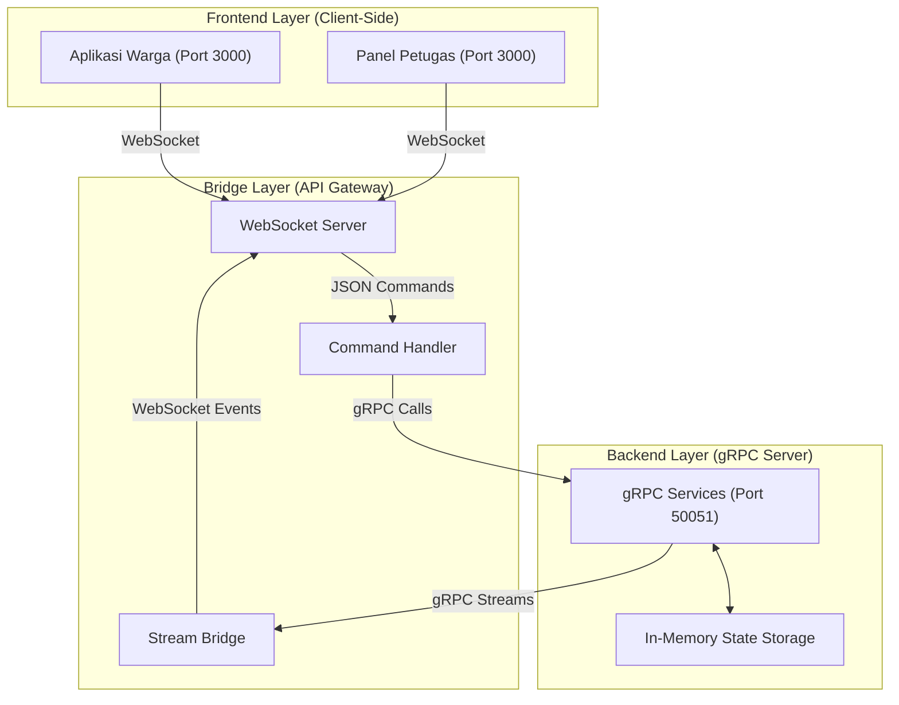

# SiAntre: Sistem Informasi Antrean Berbasis Hybrid gRPC-WebSocket

Implementasi sistem manajemen antrean layanan publik menggunakan protokol gRPC untuk komunikasi backend dan WebSocket untuk sinkronisasi antarmuka pengguna secara real-time.

---

## Anggota Kelompok

| Nama | NRP |
|------|-----|
| Ahmad Rafi Fadhillah Dwiputra | 5027241068 |
| Aditya Reza Daffansyah | 5027241034 |

---

## Deskripsi Proyek

SiAntre adalah platform digital yang dirancang untuk mengoptimalkan manajemen antrean pada institusi layanan publik. Sistem ini menyediakan mekanisme pendaftaran online, manajemen slot waktu otomatis, dan pemantauan status antrean secara real-time bagi warga. Di sisi administratif, sistem menyediakan dashboard bagi petugas untuk melakukan pemanggilan antrean, manajemen operasional, dan analisis statistik layanan.

---

## Fitur Utama

1. **Manajemen Reservasi (Booking)**: Warga dapat memilih slot waktu layanan yang tersedia secara online.
2. **Monitoring Antrean Real-Time**: Sinkronisasi data antara server dan antarmuka pengguna menggunakan WebSocket, memungkinkan pemantauan nomor antrean tanpa refresh halaman.
3. **Dashboard Administratif**: Panel kontrol bagi petugas untuk memanggil nomor antrean berikutnya, mengelola jeda layanan, dan menyiarkan pengumuman.
4. **Manajemen Slot Waktu**: Pengaturan kapasitas layanan otomatis berbasis jendela waktu (per 30 menit).
5. **Visualisasi Statistik**: Penyajian data beban kerja layanan dan sisa kuota harian dalam bentuk grafik interaktif.
6. **Registrasi Walk-In**: Kemampuan bagi petugas untuk mendaftarkan warga yang datang langsung ke lokasi tanpa reservasi online.

---

## Arsitektur Sistem

Sistem ini mengadopsi arsitektur **Three-Tier Hybrid** untuk memastikan pemisahan tugas yang jelas serta kinerja yang optimal.



### Komponen Teknis:
- **Backend (gRPC)**: Mengelola logika inti sistem menggunakan Google Remote Procedure Call. Mendukung pola Unary untuk request-response sederhana dan Streaming untuk data berkelanjutan.
- **API Gateway**: Bertindak sebagai mediator protokol yang menerjemahkan komunikasi WebSocket (JSON) dari browser menjadi panggilan gRPC (Protobuf) ke backend.
- **Frontend**: Antarmuka berbasis web yang menggunakan Vanilla JavaScript untuk menjaga performa tetap ringan dan responsif.

---

## Struktur Direktori

```text
SiAntre/
├── proto/              # Definisi Protokol (Protocol Buffers .proto)
├── server/             # Implementasi Backend (gRPC Server)
│   ├── services/       # Logika Layanan (Admin, Booking, Queue, Info)
│   ├── state/          # Manajemen Data In-Memory
│   └── helpers/        # Utilitas Broadcast dan Protokol
├── gateway/            # API Gateway (WebSocket Server & gRPC Client)
│   ├── index.js        # Titik Masuk Server WebSocket
│   ├── commandHandler.js # Pemetaan Perintah WebSocket ke gRPC
│   ├── streamBridge.js   # Sinkronisasi Stream gRPC ke WebSocket
│   └── pushScheduler.js  # Penjadwal Pembaruan Data Berkala
├── frontend/           # Aset Antarmuka Pengguna (Web Assets)
│   ├── index.html      # Antarmuka Warga
│   ├── admin.html      # Panel Dashboard Petugas
│   ├── css/            # Lembar Gaya (Styling)
│   └── js/             # Logika Klien dan WebSocket
└── client/             # Klien Legacy CLI (Berbasis Terminal)
```

---

## Alur Program (Code Walkthrough)

### 1. Inisialisasi Koneksi
Saat sistem dijalankan, API Gateway akan membuka koneksi *stream* gRPC ke Backend melalui fungsi `WatchQueue`. Koneksi ini tetap terbuka untuk mendengarkan setiap perubahan state antrean dari server.

### 2. Pengiriman Perintah (Command Handling)
Ketika pengguna (misal: Admin) menekan tombol "Panggil Berikutnya", browser mengirimkan pesan JSON melalui WebSocket ke Gateway. `commandHandler.js` menangkap pesan ini, memvalidasi identitas petugas, dan melakukan panggilan gRPC ke `AdminService.AdminSession` pada backend.

### 3. Pemrosesan Backend dan Penyiaran (Broadcast)
Backend memproses perintah, memperbarui `waiting_list` di memori, dan memicu fungsi `broadcast()`. Fungsi ini mengirimkan data terbaru melalui stream gRPC yang sedang aktif.

### 4. Sinkronisasi Real-Time (Stream Bridge)
`streamBridge.js` pada Gateway menerima pembaruan dari stream gRPC dan segera meneruskannya sebagai event WebSocket ke seluruh browser yang terhubung. Browser kemudian memperbarui elemen DOM (angka antrean, animasi) tanpa interaksi pengguna tambahan.

---

## Teknologi yang Digunakan

- **Runtime**: Node.js v18 atau lebih baru.
- **Backend Protocol**: gRPC (@grpc/grpc-js).
- **Communication Protocol**: WebSockets (ws).
- **Styling**: Vanilla CSS dengan desain modern.
- **Animation**: Anime.js.
- **Visualization**: Chart.js.

---

## Instalasi dan Penggunaan

### Prasyarat
- Node.js v18.x.x
- npm v9.x.x atau lebih baru

### Langkah Instalasi
1. Ekstrak folder proyek dan masuk ke direktori `SiAntre`.
2. Instal dependensi yang diperlukan:
   ```bash
   npm install
   ```

### Cara Menjalankan
Jalankan backend server dan API gateway secara bersamaan menggunakan perintah:
```bash
npm run dev
```

### Akses Layanan
- **Layanan Warga**: [http://localhost:3000/index.html](http://localhost:3000/index.html)
- **Dashboard Petugas**: [http://localhost:3000/admin.html](http://localhost:3000/admin.html)

---

## Catatan Teknis
Sistem menggunakan penyimpanan data di memori (*In-Memory Storage*), sehingga seluruh data transaksi dan antrean akan terhapus saat server dihentikan. Untuk inisialisasi awal, pendaftaran petugas pertama dapat dilakukan melalui halaman Admin Login.
