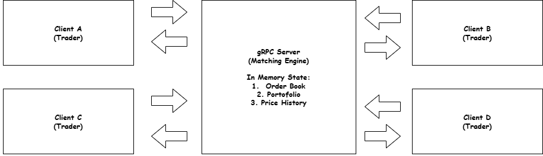

# **Virtual Stock Exchange Simulator**
### **Implementasi Sistem Komunikasi gRPC**
---

## **1. Judul**
**Virtual Stock Exchange Simulator**  
Simulasi sistem bursa saham real-time berbasis gRPC

---

## **2. Deskripsi & Tujuan**

### **Deskripsi**
Virtual Stock Exchange Simulator adalah sistem simulasi bursa saham yang memungkinkan beberapa client untuk melakukan transaksi jual-beli saham secara real-time. Server bertindak sebagai matching engine yang memproses order, mempertemukan pembeli dan penjual, serta menyiarkan perubahan harga ke seluruh client yang terhubung.

### **Tujuan**
- Mengimplementasikan komunikasi antar-layanan menggunakan protokol gRPC
- Mensimulasikan mekanisme pasar saham sederhana (order matching)
- Mendemonstrasikan penggunaan Unary dan Streaming gRPC dalam satu sistem
- Mengelola state multi-client secara bersamaan di sisi server

---

## **3. Desain Sistem**

### **Arsitektur**

### **Services (Proto)**

**1. TradingService** — transaksi inti
- `PlaceOrder` (Unary) — submit order beli/jual
- `CancelOrder` (Unary) — batalkan order yang pending
- `GetPortfolio` (Unary) — lihat saldo & kepemilikan saham

**2. MarketService** — data pasar
- `GetStockInfo` (Unary) — info harga saham saat ini
- `WatchMarket` (Server-side Streaming) — stream harga saham secara real-time ke semua client
- `GetOrderBook` (Unary) — lihat daftar order pending di pasar

**3. AccountService** — manajemen akun
- `Register` (Unary) — daftarkan client baru
- `GetBalance` (Unary) — cek saldo
- `GetTradeHistory` (Unary) — riwayat transaksi

### Alur Utama
1. Client register → dapat saldo awal (virtual money)
2. Client subscribe ke `WatchMarket` → terima stream harga real-time
3. Client kirim `PlaceOrder` → server jalankan matching engine
4. Jika order match → portfolio kedua pihak diupdate otomatis
5. Harga saham baru di-broadcast ke semua subscriber

---

## 4. Fitur-Fitur

### Fitur Wajib (sesuai requirement)
| # | Fitur | Implementasi |
|---|-------|-------------|
| 1 | Unary gRPC | `PlaceOrder`, `Register`, `GetPortfolio`, dll |
| 2 | Server-side Streaming | `WatchMarket` — harga saham real-time |
| 3 | Error Handling | Order ditolak jika saldo kurang, saham tidak cukup, dll |
| 4 | State Management In-Memory | Order book, portfolio, price history tersimpan di server |
| 5 | Multi Client | Banyak trader bisa konek dan transaksi bersamaan |
| 6 | Minimal 3 Services | `TradingService`, `MarketService`, `AccountService` |

### Fitur Tambahan
- **Order Matching Engine** — otomatis cocokkan order beli & jual berdasarkan harga terbaik
- **Price Movement** — harga saham bergerak berdasarkan supply & demand dari transaksi nyata
- **Portfolio Tracker** — tiap client bisa pantau profit/loss secara real-time
- **Leaderboard** — ranking trader berdasarkan total nilai portofolio
- **Multiple Stocks** — tersedia beberapa ticker saham simulasi (e.g. GOTO, BBCA, TLKM)

### Error Handling Cases
- Saldo tidak mencukupi untuk order beli
- Jumlah saham tidak cukup untuk order jual
- Order ID tidak ditemukan saat cancel
- Client belum terdaftar mencoba transaksi
- Harga order tidak valid (negatif / nol)

---

## Tech Stack
- **Bahasa**: Python
- **Framework**: gRPC + Protocol Buffers
- **State**: In-memory (dictionary/list di server)
- **Tampilan Client**: Terminal UI dengan library `rich`