# Paper Trading Platform
### Implementasi Sistem Komunikasi gRPC

---

## 1. Judul & Framing

**Judul:** *BursaGRPC — Paper Trading Platform*

**Tagline:** *Simulasi transaksi saham berbasis gRPC untuk edukasi investor dan pengujian strategi trading tanpa risiko finansial*

Framing ini bukan sekadar simulator — **paper trading** adalah kategori produk nyata yang dipakai industri. Stockbit, Investopedia, dan TradingView semua punya fitur ini. BursaGRPC adalah implementasi backend-nya menggunakan gRPC sebagai protokol komunikasi antar layanan.

---

## 2. Deskripsi & Tujuan

**Deskripsi:**
BursaGRPC adalah platform paper trading yang memungkinkan beberapa client (trader) untuk melakukan transaksi jual-beli saham simulasi secara real-time. Server bertindak sebagai matching engine yang memproses order, mempertemukan buyer dan seller, serta menyiarkan perubahan harga ke seluruh client. Seluruh saham menggunakan ticker nyata bursa Indonesia (BBCA, TLKM, GOTO, ASII, BMRI) dengan harga awal yang diseed dari data historis, namun bergerak berdasarkan supply-demand internal sistem.

**Tujuan:**
- Mengimplementasikan komunikasi antar-layanan menggunakan protokol gRPC dengan Node.js
- Mendemonstrasikan ketiga pola komunikasi gRPC: Unary, Server-side Streaming, dan Bi-directional Streaming
- Mensimulasikan mekanisme order matching yang dipakai di bursa saham nyata
- Mengelola state multi-client secara concurrent di sisi server

---

## 3. Desain Sistem

Gambaran Besar Arsitektur Sistem — bagaimana client, services, dan server state saling berhubungan:



Alur Request Inti — ketika trader menempatkan order sampai harga ter-broadcast ke semua client:



State Machine dari sebuah order — dari masuk sampai selesai atau dibatalkan:



<!---

## Proto Design (gRPC Services)

Berikut definisi lengkap ketiga service dalam format `.proto`, sudah disesuaikan ke JavaScript/Node.js dan framing paper trading:

```protobuf
// account_service.proto
service AccountService {
  rpc Register (RegisterRequest) returns (RegisterResponse);        // Unary
  rpc GetBalance (BalanceRequest) returns (BalanceResponse);        // Unary
  rpc GetTradeHistory (HistoryRequest) returns (HistoryResponse);   // Unary
  rpc GetPerformance (PerformanceRequest) returns (PerformanceResponse); // Unary — return rate %, win rate
}

// trading_service.proto
service TradingService {
  rpc PlaceOrder (OrderRequest) returns (OrderResponse);            // Unary
  rpc CancelOrder (CancelRequest) returns (CancelResponse);         // Unary
  rpc GetPortfolio (PortfolioRequest) returns (PortfolioResponse);  // Unary
  rpc GetOrderBook (OrderBookRequest) returns (OrderBookResponse);  // Unary
  rpc BatchPlaceOrders (stream OrderRequest) returns (BatchResponse); // Client-side streaming (bonus!)
}

// market_service.proto
service MarketService {
  rpc GetStockInfo (StockRequest) returns (StockResponse);          // Unary
  rpc WatchMarket (WatchRequest) returns (stream MarketUpdate);     // Server-side streaming
  rpc WatchLeaderboard (LeaderboardRequest) returns (stream LeaderboardUpdate); // Server-side streaming
  rpc StreamTrade (stream TradeAction) returns (stream TradeEvent); // Bi-directional streaming
}
```

Perhatikan `BatchPlaceOrders` — ini client-side streaming yang menjadi bonus. Dengan ini, kalian cover **ketiga jenis streaming sekaligus**, yang hampir pasti membedakan proyek kalian dari kelompok lain.

---

-->

## 4. Fitur & Mapping ke Requirements

| # | Requirement | Implementasi |
|---|---|---|
| 1 | Unary gRPC | `Register`, `PlaceOrder`, `GetPortfolio`, `GetStockInfo`, dll |
| 2 | Server-side streaming | `WatchMarket` — harga real-time, `WatchLeaderboard` |
| 2b | Client-side streaming | `BatchPlaceOrders` — algorithmic trader kirim banyak order |
| 2c | Bi-directional streaming | `StreamTrade` — live session trading interaktif |
| 3 | Error handling | gRPC status codes: `UNAUTHENTICATED`, `FAILED_PRECONDITION`, `INVALID_ARGUMENT`, `NOT_FOUND` |
| 4 | In-memory state | `Map` / `Array` di Node.js server: order book, portfolio, price history |
| 5 | Multi-client | Banyak trader konek bersamaan, tiap subscribe `WatchMarket` dapat stream independen |
| 6 | Min 3 services | `AccountService`, `TradingService`, `MarketService` |

**Fitur tambahan (diferensiasi):**
- Ticker saham nyata IDX: BBCA, TLKM, GOTO, ASII, BMRI
- Return % dan win rate per trader di `GetPerformance`
- Market maker bot internal — server pasang order otomatis agar pasar selalu aktif
- Leaderboard ranking berdasarkan portfolio value, update real-time

**Error handling cases dengan gRPC status codes:**

| Error case | gRPC status code |
|---|---|
| Client belum register coba trading | `UNAUTHENTICATED` |
| Saldo tidak cukup untuk order beli | `FAILED_PRECONDITION` |
| Saham tidak cukup untuk order jual | `FAILED_PRECONDITION` |
| Harga order ≤ 0 atau negatif | `INVALID_ARGUMENT` |
| Order ID tidak ditemukan saat cancel | `NOT_FOUND` |
| Ticker saham tidak dikenal | `NOT_FOUND` |

---

## 5    . Tech Stack

| Komponen | Teknologi |
|---|---|
| Language | Node.js (JavaScript) |
| gRPC framework | `@grpc/grpc-js` + `@grpc/proto-loader` |
| Terminal UI | `blessed` atau `chalk` + `cli-table3` |
| In-memory state | Native JS `Map`, `Array` |
| Market maker bot | `setInterval` loop di server |
| Testing multi-client | Jalankan beberapa instance CLI di terminal berbeda |

---