# Real-Time Collaborative Whiteboard
### Implementasi Sistem Komunikasi gRPC

---

## 1. Judul & Framing

**Judul:** *SketsaGRPC — Real-Time Collaborative Whiteboard*

**Tagline:** *Platform whiteboard kolaboratif berbasis gRPC — gambar bersama, lihat pointer semua orang, sinkron secara real-time tanpa delay*

Framing ini bukan sekadar demo teknis — **collaborative whiteboard** adalah kategori produk yang dipakai jutaan tim di seluruh dunia. Miro, FigJam, dan Excalidraw adalah bukti bahwa kebutuhan ini nyata dan bernilai tinggi. SketsaGRPC adalah implementasi backend-nya menggunakan gRPC sebagai tulang punggung komunikasi antar layanan — mendemonstrasikan mengapa protokol ini jauh lebih tepat untuk use-case real-time dibanding REST biasa.

---

## 2. Deskripsi & Tujuan

**Deskripsi:**
SketsaGRPC adalah platform whiteboard kolaboratif yang memungkinkan beberapa user untuk menggambar, menulis, dan berinteraksi di kanvas yang sama secara real-time. Setiap user terhubung ke server sebagai client independen — pointer mouse mereka terlihat oleh semua peserta lain, shape yang mereka tambahkan langsung tersinkron ke seluruh ruangan, dan mereka bisa berkomunikasi lewat chat sidebar tanpa meninggalkan kanvas. Server mengelola seluruh state kanvas dan menjadi satu sumber kebenaran (*single source of truth*) bagi semua client.

**Tujuan:**
- Mengimplementasikan komunikasi antar-layanan menggunakan protokol gRPC dengan Node.js
- Mendemonstrasikan **ketiga pola komunikasi gRPC** dalam satu sistem yang kohesif: Unary, Server-side Streaming, Client-side Streaming, dan Bi-directional Streaming
- Mensimulasikan mekanisme real-time collaboration yang dipakai di tools industri seperti Miro dan FigJam
- Mengelola state multi-client (kanvas bersama, sesi, cursor) secara concurrent di sisi server

---

## 3. Desain Sistem

Gambaran besar arsitektur sistem — bagaimana client, ketiga services, dan server state saling berhubungan:



Alur request inti — ketika user menambah shape sampai ter-broadcast ke semua peserta di room:



State machine sebuah shape — dari draft, terpublikasi, diedit, hingga dihapus:



---

## 4. Fitur & Mapping ke Requirements

| # | Requirement | Implementasi |
|---|---|---|
| 1 | Unary gRPC | `CreateRoom`, `JoinRoom`, `GetCanvasSnapshot`, `GetRoomInfo`, `SendChatMessage` |
| 2a | Server-side streaming | `WatchCanvas` — broadcast perubahan shape ke semua client di room |
| 2b | Client-side streaming | `StreamCursorMovements` — user kirim posisi mouse terus-menerus, server broadcast ke peserta lain |
| 2c | Bi-directional streaming | `LiveSession` — sesi interaktif: user kirim drawing actions, server balas dengan canvas events (undo, lock, dll) |
| 3 | Error handling | gRPC status codes: `NOT_FOUND`, `ALREADY_EXISTS`, `UNAUTHENTICATED`, `PERMISSION_DENIED`, `INVALID_ARGUMENT` |
| 4 | In-memory state | `Map` di Node.js server: rooms, shapes per room, connected users, cursor positions |
| 5 | Multi-client | Banyak user konek ke room yang sama, tiap subscribe `WatchCanvas` dapat stream independen |
| 6 | Min 3 services | `SessionService`, `CanvasService`, `CursorService` |

**Fitur tambahan (diferensiasi):**
- Shape types: rectangle, ellipse, line, freehand (pen), dan sticky note
- Setiap user punya warna pointer unik yang otomatis di-assign saat join
- `GetCanvasSnapshot` — unary call untuk sync state awal saat user baru join room
- Export canvas ke JSON (representasi semua shapes) lewat unary call
- Room bisa di-set public atau private dengan room code
- Shape locking — user bisa lock shape miliknya agar tidak diedit orang lain

**Error handling cases dengan gRPC status codes:**

| Error case | gRPC status code |
|---|---|
| Join room dengan ID yang tidak ada | `NOT_FOUND` |
| Buat room dengan nama yang sudah dipakai | `ALREADY_EXISTS` |
| Kirim drawing action tanpa join room dulu | `UNAUTHENTICATED` |
| Edit/hapus shape milik user lain | `PERMISSION_DENIED` |
| Koordinat shape di luar batas kanvas | `INVALID_ARGUMENT` |
| Tipe shape tidak dikenali | `INVALID_ARGUMENT` |
| Room sudah penuh (melebihi kapasitas) | `RESOURCE_EXHAUSTED` |

---

## 5. Tech Stack

| Komponen | Teknologi |
|---|---|
| Language | Node.js (JavaScript) |
| gRPC framework | `@grpc/grpc-js` + `@grpc/proto-loader` |
| Client UI | Browser (HTML Canvas + vanilla JS) atau Terminal CLI dengan `blessed` |
| In-memory state | Native JS `Map`, `Array` |
| Cursor broadcast | `setInterval` throttle di server — update cursor max 30x/detik |
| Testing multi-client | Buka beberapa tab browser / terminal yang konek ke room yang sama |

---
<!---
## 6. Proto Design (gRPC Services)

Definisi lengkap ketiga service dalam format `.proto`:

```protobuf
// session_service.proto
service SessionService {
  rpc CreateRoom (CreateRoomRequest) returns (CreateRoomResponse);    // Unary
  rpc JoinRoom (JoinRoomRequest) returns (JoinRoomResponse);          // Unary
  rpc LeaveRoom (LeaveRoomRequest) returns (LeaveRoomResponse);       // Unary
  rpc GetRoomInfo (RoomInfoRequest) returns (RoomInfoResponse);       // Unary
}

// canvas_service.proto
service CanvasService {
  rpc GetCanvasSnapshot (SnapshotRequest) returns (SnapshotResponse); // Unary — sync awal
  rpc AddShape (AddShapeRequest) returns (AddShapeResponse);          // Unary
  rpc DeleteShape (DeleteShapeRequest) returns (DeleteShapeResponse); // Unary
  rpc ExportCanvas (ExportRequest) returns (ExportResponse);          // Unary
  rpc WatchCanvas (WatchRequest) returns (stream CanvasEvent);        // Server-side streaming
  rpc LiveSession (stream DrawingAction) returns (stream CanvasEvent);// Bi-directional streaming
}

// cursor_service.proto
service CursorService {
  rpc StreamCursorMovements (stream CursorPosition) returns (CursorAck); // Client-side streaming
  rpc WatchCursors (WatchRequest) returns (stream CursorUpdate);          // Server-side streaming
  rpc SendChatMessage (ChatRequest) returns (ChatResponse);               // Unary
}
```

> **Catatan:** `StreamCursorMovements` adalah client-side streaming — user terus-menerus mengirim posisi mouse tanpa menunggu respons per-posisi. `LiveSession` adalah bi-directional streaming — cocok untuk sesi menggambar interaktif di mana server bisa membalas dengan events (shape di-lock orang lain, undo dari user lain, dll). Dengan ini, **ketiga jenis streaming** tercakup sekaligus.

---
--->